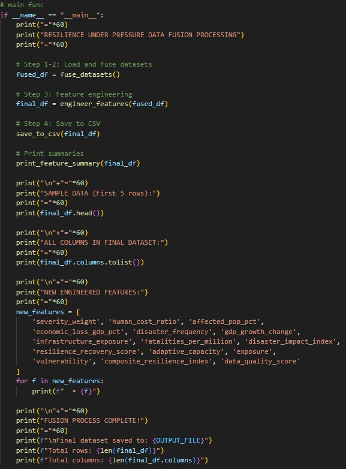
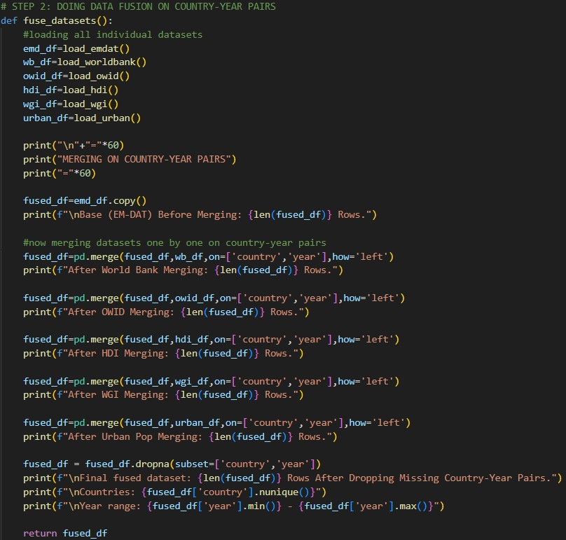
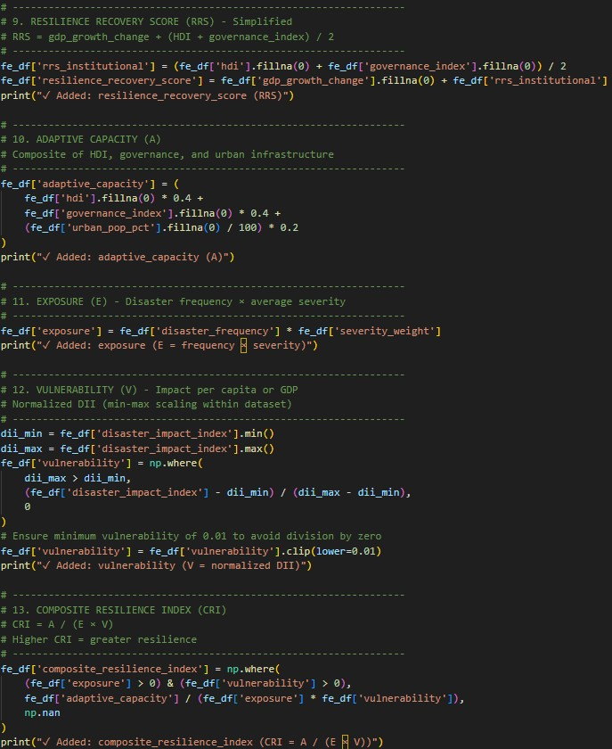
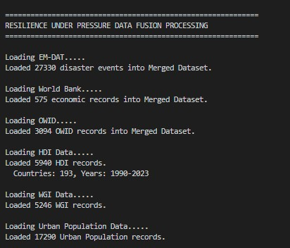
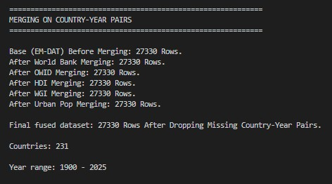
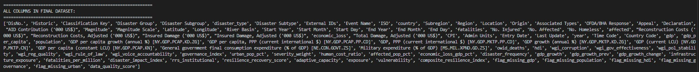
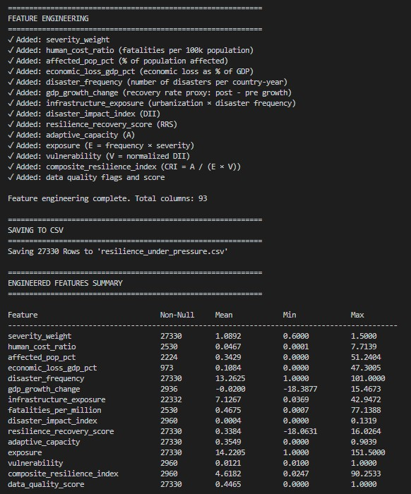

# Multi-Dimensional Disaster Resilience Analysis

## Overview

Multi-Dimensional Disaster Resilience Analysis is a global data analysis and visualization project focused on understanding disaster resilience through a fused, multi-source dataset. The repository is built around the idea that resilience is not a single value or a simple yes/no condition. Instead, it is a combination of several interconnected dimensions that together shape how a country or region experiences and responds to disasters. In this project, those dimensions are framed through exposure, vulnerability, and adaptive capacity, with the final insights presented through interactive Tableau visualizations and supporting analytical outputs.

The repository is structured as a complete workflow: raw inputs are collected, data is merged and cleaned, features are engineered, results are generated, documentation is stored, and a Tableau workbook is used to communicate the findings. This makes the project useful not only as an analysis artifact, but also as a reproducible data pipeline and an interactive storytelling tool.

The aim of the repository is to support a deeper understanding of global disaster resilience. By combining multiple datasets and transforming them into one coherent structure, the project makes it possible to compare resilience patterns across countries, inspect relationships between indicators, and identify areas where risk may be amplified or reduced by socioeconomic and structural conditions.

## Project Objective

The main objective of the project is to build a practical framework for disaster resilience analysis. Disaster resilience is often discussed in broad terms, but meaningful analysis requires measurable indicators. This repository attempts to create a more structured approach by linking together data about exposure, vulnerability, and adaptive capacity.

The project is especially useful for:

- comparing resilience across countries or regions
- identifying patterns in disaster susceptibility
- supporting evidence-based policy discussions
- exploring how different indicators interact
- communicating complex results in a visual and accessible form

The analysis is designed to answer questions such as:

- Which places appear most vulnerable to disasters?
- What indicators contribute to stronger or weaker resilience?
- How do exposure and adaptive capacity interact?
- What does the final fused dataset reveal about regional differences?

## Repository Structure

The repository is organized into several clearly separated folders that reflect the project workflow from source code to final outputs.

### `src/`
This folder contains the core Python source code for the project.

- `src/fusion.py` is the main processing script.
- It is responsible for combining datasets, preparing the analytical structure, and generating the final fused dataset used in later stages.
- The script likely includes cleaning logic, column harmonization, feature creation, and export operations.

This source folder is the engine of the repository. It transforms raw inputs into something ready for analysis and visualization.

### `data/`
This folder contains the data inputs and processed versions of the dataset.

- `data/raw/` stores original or source-level data files.
- `data/processed/` stores transformed or cleaned outputs that are ready for analysis.

This separation is important because it preserves the original data while keeping derived outputs organized and reproducible.

### `docs/`
This folder stores written documentation that explains the project in greater detail.

- `Dataset_Documentation_Sheet.pdf` describes the dataset, its structure, and likely the meaning of the variables.
- `Multi-Dimensional-Disaster-Resilience-Analysis_Report.pdf` contains the main project report with methodology, analysis, and results.

These documents help explain the project beyond the code itself and are essential for interpretation.

### `metadata/`
This folder contains metadata files that support project traceability.

- `authors.txt` lists authorship or contributor information.

### `results/`
This folder contains outputs generated by the analysis pipeline.

- `results/tables/` stores tabular outputs.
- `results/visualizations/` stores visual or chart-based output files.

This folder reflects the final analytical stage of the project, where processed data becomes interpretable results.

### `tableau/`
This folder contains the packaged Tableau workbook.

- `multi-dimensional-disaster-resilience-analysis.twbx` is the Tableau project file that holds dashboards and interactive visualizations.

This is where the final visual storytelling occurs.

### `screenshots/`
This folder contains screenshots that document the project workflow and outputs.

- `screenshots/code/` focuses on the code and data-preparation stages.
- `screenshots/outputs/` focuses on the resulting datasets and output artifacts.

The screenshots make the repository much easier to understand because they provide visual evidence of the workflow.

## README Status Before Update

The existing README in the repository is minimal and only contains the title `# Dav-Project`. That means the repository currently lacks a full description of the project purpose, workflow, folder structure, analysis method, screenshots, and results. A detailed README is especially important for a project like this because it helps users understand the relationship between the code, the fused dataset, and the Tableau visualizations.

## Workflow Summary

The repository follows a clear end-to-end workflow.

1. **Raw datasets are collected** and stored in the `data/raw/` directory.
2. **The fusion script** in `src/fusion.py` loads and merges the source data.
3. **Data cleaning and transformation** are applied to standardize the structure.
4. **Feature engineering** creates relevant variables for resilience analysis.
5. **Processed outputs** are saved in `data/processed/` and `results/`.
6. **Documentation** is stored in the `docs/` folder for reference and interpretation.
7. **Tableau dashboards** are created in the `tableau/` workbook.
8. **Screenshots** are captured to visually explain the workflow and outputs.

This type of pipeline is useful because it keeps analysis steps transparent and allows each stage of the project to be inspected separately.

## Data Fusion and Feature Engineering

The most important technical part of the repository is the fusion workflow. Disaster resilience analysis usually requires multiple indicators that come from different sources and may use different formats. These indicators must be merged into one consistent structure before they can be analyzed together.

The `fusion.py` script appears to be the central component for that process. It likely performs several tasks:

- loading raw input datasets
- matching records across shared fields such as country or region
- normalizing names and column structures
- cleaning null, duplicate, or inconsistent values
- building resilience-related derived features
- exporting the final fused dataset

Feature engineering is especially important because raw indicators alone may not directly express resilience. Instead, resilience has to be inferred or modeled through combinations of factors. For example, a region with high exposure may not be equally vulnerable if it also has strong adaptive capacity. Likewise, a country with moderate exposure may still face high disaster risk if its vulnerability is severe and its infrastructure is weak.

The screenshot set in `screenshots/code/` and `screenshots/outputs/` gives a visual explanation of this transformation process.

## Tableau and Visualization Layer

The Tableau workbook in the `tableau/` folder is the presentation layer of the project. It turns the fused and engineered dataset into a visual interface where users can explore patterns interactively.

This is important because disaster resilience is easier to understand when the data is displayed in a visual format rather than only in tables. Tableau can help users:

- compare countries side by side
- examine resilience dimensions interactively
- inspect patterns across regions
- identify outliers and clusters
- explore the impact of feature engineering on the final dataset

The workbook serves as the bridge between the analytical backend and the communication layer of the project.

## Screenshots and What They Show

The screenshots are one of the most useful parts of the repository because they make the workflow easier to follow.

### Project flow

This image shows the overall conceptual and operational flow of the project, helping the viewer understand how the analysis is organized from start to finish.

### Merging datasets

This screenshot captures the dataset fusion stage, where multiple data sources are combined into one coherent structure.

### Important metrics during feature engineering

This image highlights the key indicators or metrics used to build the disaster resilience framework.

### Loading datasets

This screenshot documents the beginning of the data workflow, showing the input datasets being loaded for processing.

### Final fused dataset

This screenshot shows the consolidated dataset that results after the merging and transformation workflow.

### Final fused dataset column names

This image helps explain the structure of the final dataset by showing the names of the generated fields.

### Feature engineering output

This screenshot presents the final result of the feature-engineering stage, where derived indicators are prepared for analysis and visualization.

## Technical Highlights

The repository has several notable technical characteristics:

- Written entirely in **Python**
- Uses a modular folder structure to separate source code, data, results, and documentation
- Includes a **dataset fusion pipeline**
- Applies **feature engineering** to support resilience analysis
- Produces **processed outputs** for later use
- Includes a **Tableau workbook** for interactive analysis
- Uses screenshots to document the workflow and final results
- Supports a complete path from raw data to polished presentation

## Why the Project Is Valuable

Disaster resilience is a critical topic because it affects humanitarian planning, climate adaptation, infrastructure development, and public policy. A repository like this is valuable because it does more than store data or produce charts. It builds a structured framework for understanding a complex problem.

The project can be useful for:

- researchers studying vulnerability and resilience
- decision-makers involved in disaster planning
- educators teaching data analysis and resilience concepts
- analysts comparing regions and building summaries
- visualization designers creating interactive explanation tools

By fusing datasets and organizing the outputs carefully, the repository supports both technical analysis and public communication.

## Conclusion

Multi-Dimensional Disaster Resilience Analysis is a strong example of a data-driven project built around fusion, feature engineering, documentation, and interactive visualization. The repository is thoughtfully organized into source code, data, documentation, results, screenshots, and Tableau assets, which makes the workflow understandable and reproducible.

The project’s main strength is that it turns a complex topic into a structured analytical pipeline. Instead of relying on one dataset or one metric, it combines multiple dimensions of resilience into a single framework that can be explored visually and interpreted meaningfully. The screenshots and documentation make the analysis accessible, while the Tableau workbook adds an interactive layer for presentation and discovery.

Overall, this repository provides a complete foundation for understanding disaster resilience at a global level and presents the results in a clear, professional, and visually supported format.
