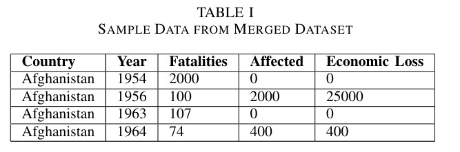
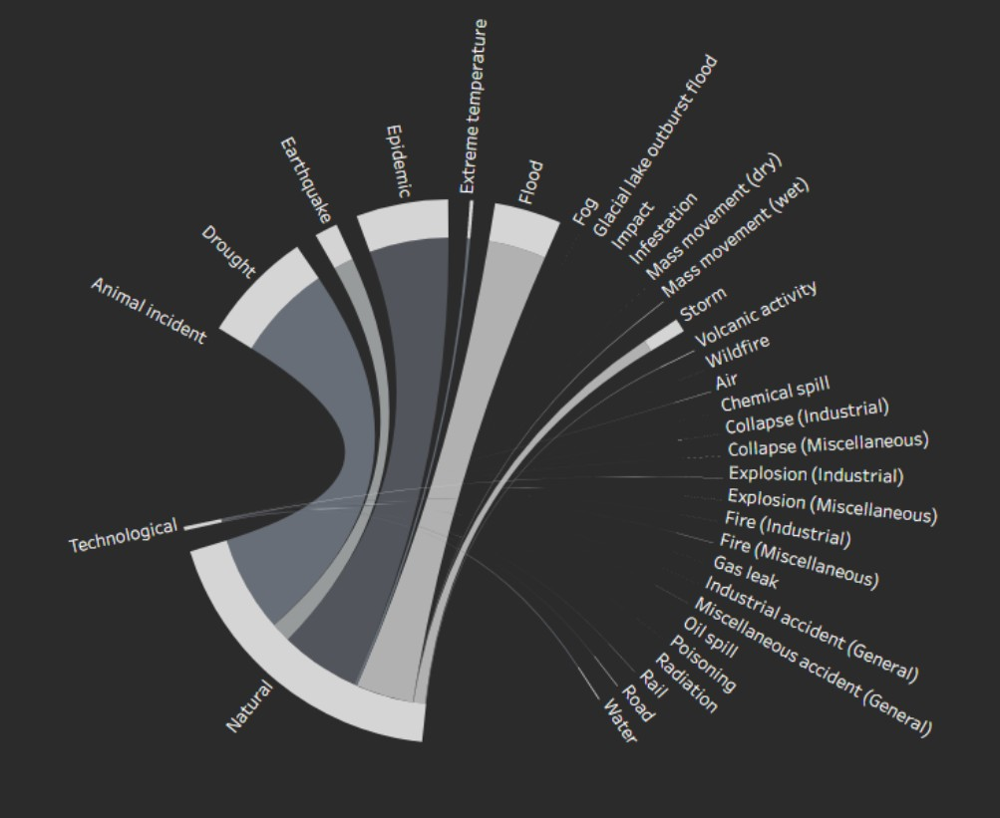
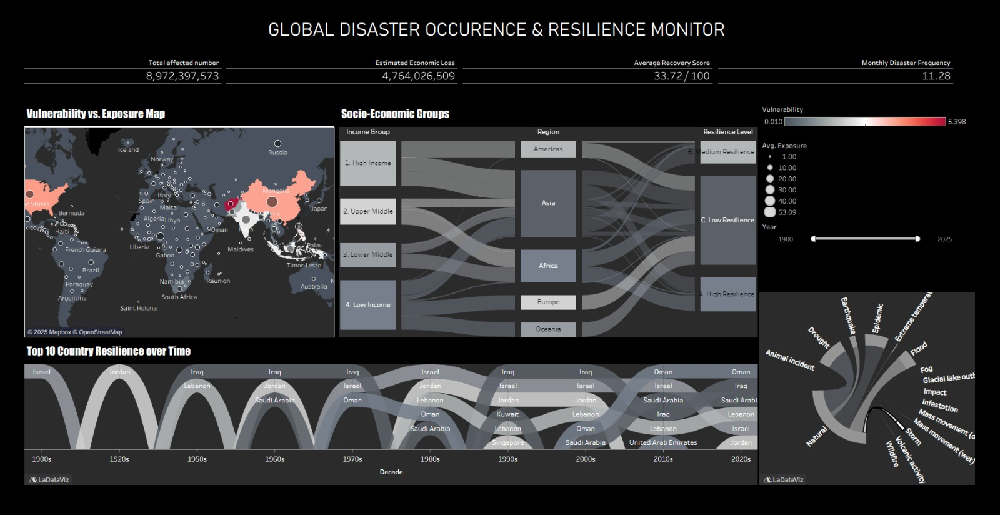
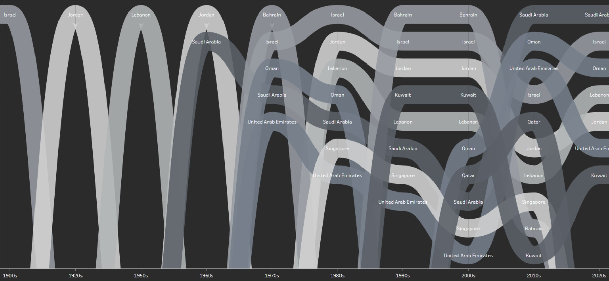
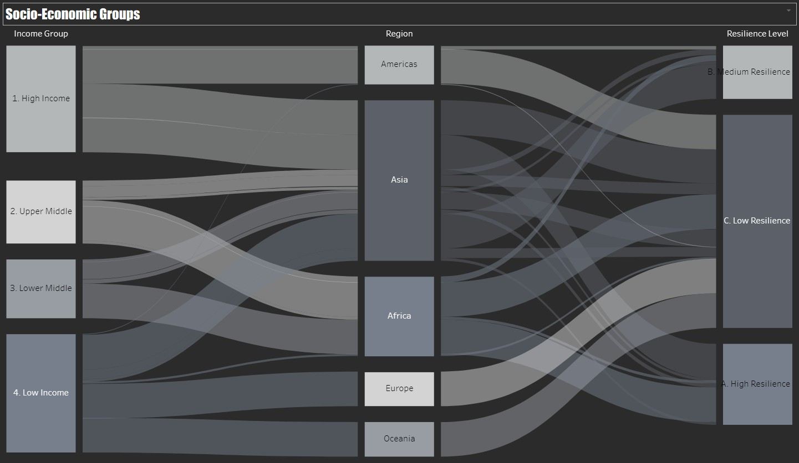
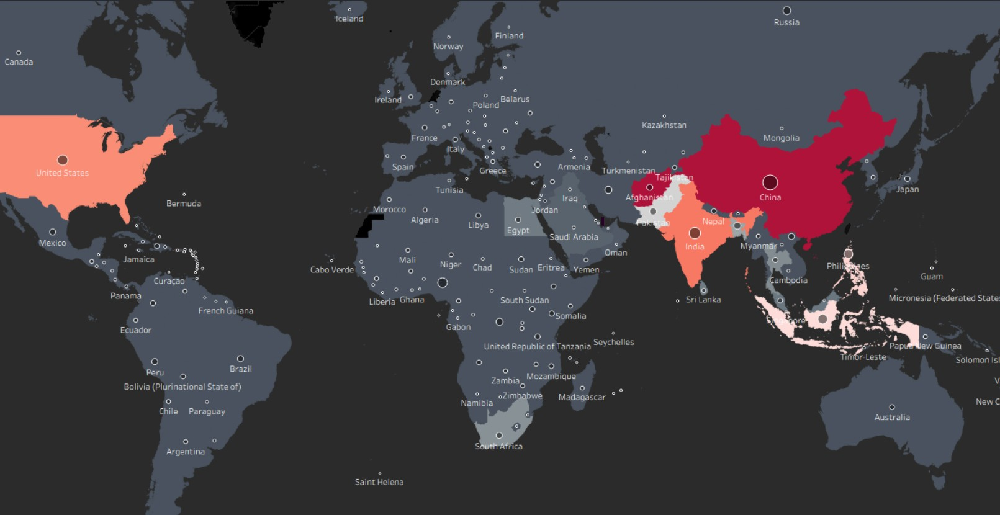

# Multi-Dimensional Disaster Resilience Analysis

## Overview

Multi-Dimensional Disaster Resilience Analysis is a global data fusion, feature engineering, and visualization project designed to study disaster resilience through multiple analytical dimensions. The repository focuses on how different countries and regions can be compared using indicators that reflect exposure, vulnerability, and adaptive capacity. Rather than reducing resilience to a single score, the project builds a richer analytical framework that combines raw source data, processed outputs, documentation, and interactive Tableau-based storytelling.

The repository is structured as a complete workflow from data preparation to presentation. It includes Python code for merging and transforming datasets, generated results stored as images and tables, documentation files that describe the dataset and methodology, and a Tableau workbook used for interactive reporting. This makes the project valuable not only as an academic or analytical exercise, but also as a reproducible and well-organized data workflow.

The overall purpose of the repository is to provide a clearer understanding of how disaster resilience varies across the world. By combining multiple indicators into one unified dataset, the project helps reveal patterns that would be difficult to observe in isolated sources. It also demonstrates how feature engineering and visual analytics can turn complex, multi-dimensional data into a compelling story.

## Project Objective

The central objective of this repository is to analyze global disaster resilience in a way that is both data-driven and visually interpretable. Disaster resilience is influenced by many factors: economic strength, social conditions, environmental exposure, and a region’s ability to adapt after a disaster. This project brings those ideas together into a single analytical pipeline.

The project aims to:

- merge datasets from different sources
- create a unified analytical structure
- engineer variables that support resilience interpretation
- compare countries and regions across multiple dimensions
- present results through clear visuals and dashboards
- document the process for transparency and reproducibility

In practice, the project provides a foundation for exploring questions such as:

- Which countries appear most exposed to disaster-related risk?
- How does vulnerability differ across socio-economic groups?
- What role does adaptive capacity play in resilience?
- How can visual storytelling improve understanding of disaster patterns?

## Repository Structure

The repository is cleanly organized into folders that reflect the full lifecycle of the analysis.

### `src/`
This folder contains the Python source code for the project.

- `src/fusion.py` is the key processing script.
- It is responsible for loading raw data, merging datasets, cleaning and transforming fields, and generating the final dataset used for analysis and Tableau visualization.
- This script represents the computational core of the repository.

### `data/`
This folder contains the raw and processed data assets.

- `data/raw/` stores original input datasets.
- `data/processed/` stores cleaned or transformed outputs used in later steps.

This separation helps preserve the original data while keeping processed files organized and easy to reuse.

### `docs/`
This folder contains project documentation.

- `Dataset_Documentation_Sheet.pdf` describes the dataset and its structure.
- `Multi-Dimensional-Disaster-Resilience-Analysis_Report.pdf` is the main report, which likely explains methodology, findings, and interpretation.

### `metadata/`
This folder contains metadata files supporting the project.

- `authors.txt` records author contributions and responsibilities.

### `results/`
This folder contains output artifacts from the analysis.

- `results/tables/` includes tabular outputs.
- `results/visualizations/` includes visual screenshots and analytical images.

### `tableau/`
This folder contains the Tableau workbook.

- `multi-dimensional-disaster-resilience-analysis.twbx` is the packaged Tableau project used for interactive dashboards.

### `screenshots/`
This folder contains project screenshots that help explain the workflow and final outputs.

- `screenshots/code/` documents the code and data-fusion process.
- `screenshots/outputs/` documents final datasets and output artifacts.

## Workflow Summary

The project follows a simple but effective workflow:

1. Raw data is collected and placed in `data/raw/`.
2. The Python script in `src/fusion.py` merges and transforms the datasets.
3. The fused data is cleaned and refined into an analysis-ready format.
4. Output tables and visualizations are saved in `results/`.
5. Documentation is stored in `docs/`.
6. The Tableau workbook in `tableau/` is used to build interactive dashboards.
7. Screenshots are captured to explain the workflow and final outputs.

This pipeline makes the repository practical, understandable, and reproducible.

## Data Fusion and Feature Engineering

The most important technical component of this project is the fusion workflow. Disaster resilience analysis often requires combining multiple datasets that may use different formats, variable names, and levels of granularity. The purpose of the fusion process is to create one clean and meaningful analytical dataset from those sources.

The `src/fusion.py` script likely performs tasks such as:

- loading multiple source files
- aligning country or region identifiers
- standardizing names and column formatting
- cleaning missing values and inconsistencies
- building derived metrics for resilience analysis
- exporting the final dataset for Tableau and reporting

Feature engineering is essential because raw indicators alone often do not communicate resilience clearly. By combining variables into meaningful dimensions, the analysis can reflect broader concepts such as exposure, vulnerability, and capacity. This allows the final dashboards and tables to communicate more than just raw values — they tell a story about resilience conditions across the world.

## Authors and Contributions

The repository includes a metadata file that documents author contributions.

### `metadata/authors.txt`
The authorship file identifies the contributors and their roles:

- **i232520 – Muhammad Noor**
  - Helped in data finding
  - Helped in data fusion
  - Helped in documenting dataset sheet
  - Report making and analysis summarization

- **i232536 – Ibrahim Kiani**
  - Helped in making Tableau visualizations
  - Feature engineering and model formulation
  - Conducted comparative analysis
  - Conducted analytical storytelling

This shows that the project was not only built as a code artifact, but also developed through a collaborative workflow where each contributor played a distinct role in the analysis and presentation stages.

## Dataset Documentation

The repository includes a dataset documentation sheet in the `docs/` folder.

### `docs/Dataset_Documentation_Sheet.pdf`
This file provides important supporting information about the dataset, including its structure, likely source context, and the meaning of the fields used in the analysis. In a project like this, documentation is critical because the final interpretation depends on understanding what each variable represents and how the data was prepared.

A dataset documentation sheet helps users:

- understand the data sources
- interpret the columns correctly
- trace how variables were derived
- evaluate the reliability of the analysis
- reproduce the workflow if needed

## Tableau Workbook

The `tableau/` folder contains the interactive reporting layer of the project.

### `tableau/multi-dimensional-disaster-resilience-analysis.twbx`
This is the Tableau packaged workbook used to create interactive dashboards and visual storytelling views. Although the workbook contents cannot be extracted directly from the repository listing, its presence confirms that the project includes an exploratory and presentation-focused visualization layer.

The Tableau workbook is important because it transforms the dataset into a user-friendly visual experience. It likely supports:

- comparison of resilience-related indicators
- filtering and interaction by country or region
- thematic dashboards for different dimensions
- clear visual storytelling for non-technical audiences

In this project, Tableau appears to be the final communication platform that turns the processed dataset and analytical outputs into an accessible dashboard experience.

## Results Folder

The `results/` directory contains output files that show the final state of the analysis.

### `results/tables/`
This folder contains tabular output artifacts.

- `results/tables/finalised-headed-dataset.jpg`

This image shows the final prepared dataset in a tabular format. It is important because it demonstrates that the data fusion and feature engineering steps produced a clean and structured final dataset suitable for analysis.

### `results/visualizations/`
This folder contains the visual outputs of the project.

- `results/visualizations/disaster-types-flow.jpg`
- `results/visualizations/interactive-dashboard-overview.jpg`
- `results/visualizations/resilience-over-time.jpg`
- `results/visualizations/socio-economic-groups.jpg`
- `results/visualizations/vulnerability-vs-exposure-map.jpg`

These screenshots provide a visual summary of the analytical output and likely represent key findings or dashboard views.

## Screenshots: Code and Workflow

The `screenshots/code/` folder documents the preparation and fusion process.

### Project flow

This image outlines the overall workflow of the repository and how data moves through the project from source to output.

### Merging datasets

This screenshot shows the key data-merging stage, where multiple inputs are combined into a unified structure.

### Important feature-engineering metrics

This image highlights the major indicators and values used to build the resilience framework.

## Screenshots: Final Outputs

The `results/outputs/` and `results/visualizations/` files show how the project concludes with tables and visuals.

### Finalised headed dataset

This screenshot shows the resulting analysis-ready table, confirming that the data fusion process produced a structured dataset.

### Disaster types flow

This visual appears to summarize how disaster categories or pathways are represented in the final analysis.

### Interactive dashboard overview

This screenshot presents the overall dashboard layout and shows how the final visualization experience is organized.

### Resilience over time

This image likely shows temporal trends, helping the viewer understand how resilience-related measures change over time.

### Socio-economic groups

This visualization likely compares patterns across different social or economic groupings, which is a core part of multi-dimensional resilience analysis.

### Vulnerability vs exposure map

This screenshot likely compares two of the most important dimensions in the project — vulnerability and exposure — in a geographic or matrix-based view.

## Summary of Visual Assets

The screenshots and result images together document the full project pipeline:

- the **code screenshots** explain how data is merged and prepared
- the **tables screenshot** confirms the final dataset structure
- the **visualization screenshots** communicate the findings and dashboard outputs

These assets are important because they make the project understandable even to someone who does not run the code directly.

## Analytical Value

This repository is useful because it approaches disaster resilience as a structured, multi-dimensional problem. That matters because resilience cannot be captured by one indicator alone. A place may have high exposure but also strong adaptive capacity, or low exposure but significant vulnerability. Only by combining these aspects can meaningful comparisons be made.

The project therefore supports:

- policy-oriented analysis
- regional comparison
- storytelling through dashboards
- educational use in data science and geography
- reproducible data transformation workflows

## Technical Highlights

- Written entirely in **Python**
- Uses a modular project structure
- Includes a dataset fusion pipeline
- Applies feature engineering for resilience analysis
- Stores results as both tables and visual assets
- Includes documentation files for transparency
- Uses Tableau for interactive storytelling
- Provides screenshots for clear explanation of the workflow and outputs

## Conclusion

Multi-Dimensional Disaster Resilience Analysis is a complete and carefully organized project for understanding disaster resilience through fused data, engineered features, and interactive visual storytelling. The repository combines data processing, documentation, output generation, and dashboard presentation into one coherent workflow.

Its strength lies in the way it connects technical analysis to visual communication. The Python fusion script prepares the data, the documentation explains the dataset, the results folder captures the outputs, and the Tableau workbook delivers the final interactive experience. The screenshots reinforce this workflow by showing the project’s structure, the data preparation process, and the resulting visuals.

Overall, this repository provides a strong example of how data fusion and visualization can be used to study a complex global issue in a clear, reproducible, and meaningful way.
